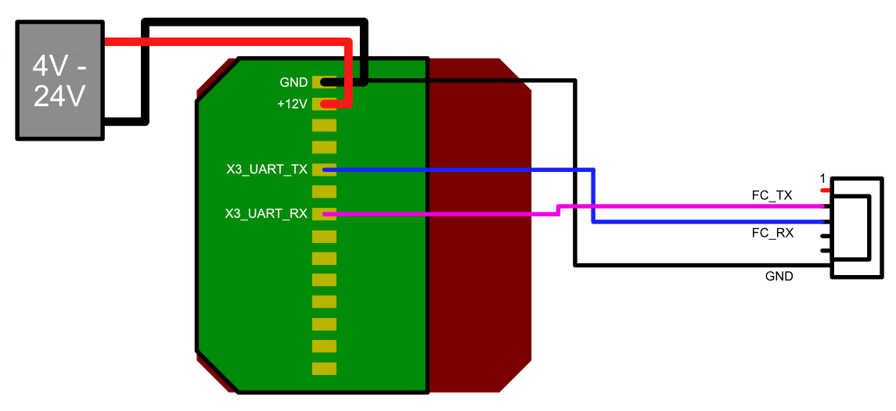

.. _common-external-ahrs-anellox3:

=======================
ANELLO Photonics X3
=======================

The ANELLO X3 is a compact and highly reliable optical gyroscope-based inertial measurement unit
(IMU) for autonomous applications in GNSS-denied environments. The X3 includes three ANELLO
SiPhOGTM sensors, each containing ANELLO’s high-performance single axis optical gyroscope and a 6-
axis MEMS IMU, along with a 3-axis magnetometer. The ANELLO X3 is the world’s smallest 3 axis optical
gyro-based IMU, with the low-noise (ARW < 0.05 deg/√hr) and low-drift (bias instability < 0.5 deg/hr)
required for autonomous applications in GNSS-denied environments. The low SWaP (size, weight, and
power) enables its use in small unmanned aerial and maritime vehicles.

This page describes how to configure, connect, and use the X3 within the Ardupilot ecosystem.

More information about ANELLO Photonics provided at: `ANELLO Photonics <https://www.anellophotonics.com/>`_

Hardware Setup
==============

Please consult the `X3 Getting Started Guide <https://docs-a1.readthedocs.io/en/latest/getting_started_x3.html>`_ prior to following the setup steps for Ardupilot use.

Wiring
------

The X3 will work when connected to any of the available UARTs on your flight controller. Ensure that the port connected to is selected properly via the use of:

- SERIALx_PROTOCOL = 'AHRS' (36)

The default baud rate of the X3 is 460800. We instruct Ardupilot to match this baud via:

- SERIALx_BAUD = 460800

Sensor Configuration
====================

The X3 is capable of streaming data in both an ASCII format as well as an RCTM-based binary format. To communicate with Ardupilot, the system must be pre-configured to stream in RCTM mode.

To do this, the command ``#APCFG,W,mfm,4*7A`` must be passed to the X3. This can be done using any program which allows for serial data to be passed to the device, some examples including:

  - `Minicom <https://en.wikipedia.org/wiki/Minicom>`_
  - `PuTTY <https://www.putty.org/>`_

ArduPilot Configuration
=======================

- :ref:`AHRS_EKF_TYPE<AHRS_EKF_TYPE>` = 3 (ArduPilot’s EKF3)
- :ref:`EK3_ENABLE<EK3_ENABLE>` = 1
- :ref:`EAHRS_TYPE<EAHRS_TYPE>` = 11 (AnelloX3)
- :ref:`EAHRS_OPTIONS<EAHRS_OPTIONS>` = 0
- :ref:`EAHRS_SENSORS<EAHRS_SENSORS>` = 10 (IMU + Compass)
- :ref:`EAHRS_RATE<EAHRS_RATE>` = 200 (Hz)

This last option should be set to equal the rate set on the X3. 200 Hz is the
speed which the X3 is configured with by default.

Running as the sole IMU
=======================

Warning: As the maximum rate of the X3 is 200 Hz, the system should not be flown
as the sole IMU! Ardupilot requires a loop rate of at least 400 Hz, otherwise the
user will be warned of a slow main loop.
This mode should only be used for testing the functionality of the
X3 within Ardupilot on the ground.

By default, when an external AHRS system is used (i.e., one of the serial ports is configured for 'AHRS'), it will take the 0 spot in the lineup of IMUs.
The system can be configured to isolate operation to the X3 alone, foregoing the use of the other onboard IMUs. This is accomplished by setting the following parameters:

- :ref:`INS_ENABLE_MASK<INS_ENABLE_MASK>` = 1 (First IMU only)
- :ref:`INS_USE<INS_USE>` = 1
- :ref:`INS_USE2<INS_USE2>` = 0
- :ref:`INS_USE3<INS_USE3>` = 0
- :ref:`EK3_IMU_MASK<EK3_IMU_MASK>` = 1

Published Data
==============

The data stream from the X3 is saved in the dataflash log file via the following messages:

The AX31 (Anello X3 Packet 1) message contains the IMU output data:

- TimeUS: Time since system startup (microseconds)
- BootNS: Time since AX3 startup (nanoseconds)
- SyncNS: Time since last sync signal (nanoseconds)
- AX1: Accel x value (m/s^2)
- AY1: Accel y value "
- AZ1: Accel z value "
- WX1: Mems gyro x value (rad/s)
- WY1: Mems gyro y value "
- WZ1: Mems gyro z value "
- OG_WX: FOG gyro x value "
- OG_WY: FOG gyro y value "
- OG_WZ: FOG gyro z value "

The EAHA (External AHRS Attitude) message contains magnetometer data, temperature,
and error flag data:

- TimeUS: Time since system startup (microseconds)
- MAG_X: Mag x value (mG)
- MAG_Y: Mag y value "
- MAG_Z: Mag z value "
- Temp: system temperature, in Celsius (deg. C)
- FusStatX: fusion status for the x-axis IMU (Bitfield)
- FusStatY: fusion status for the y-axis IMU "
- FusStatZ: fusion status for the z-axis IMU "
